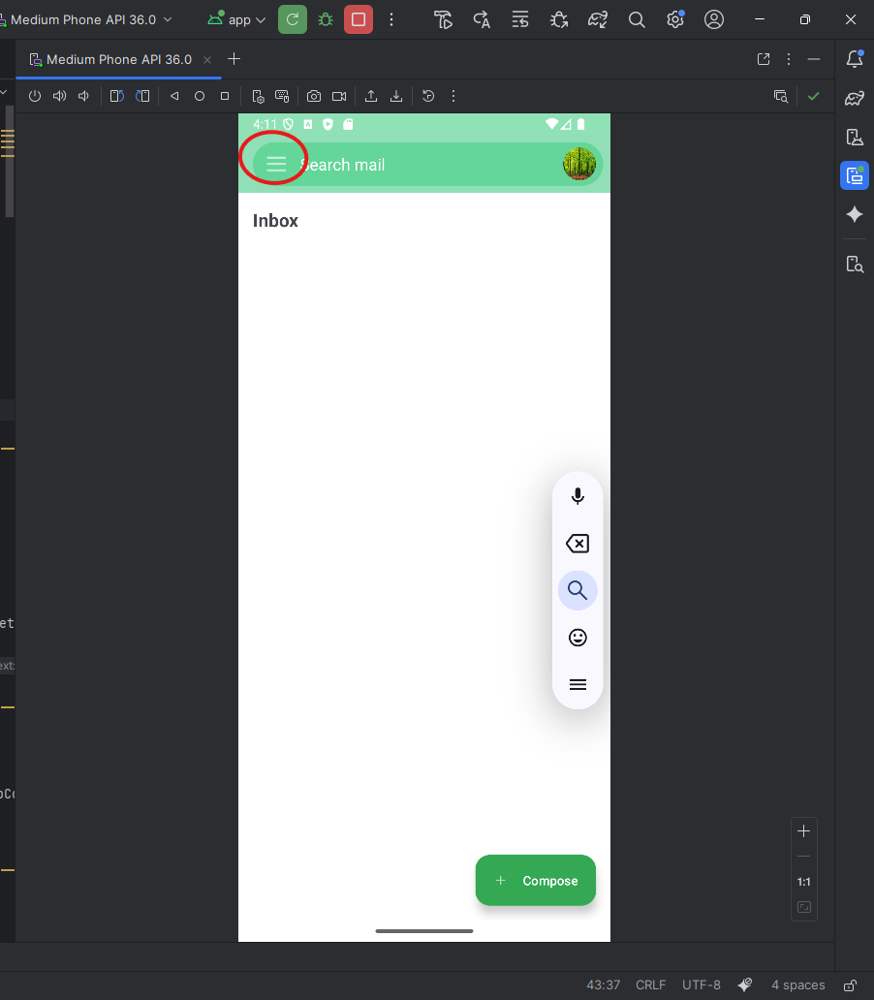
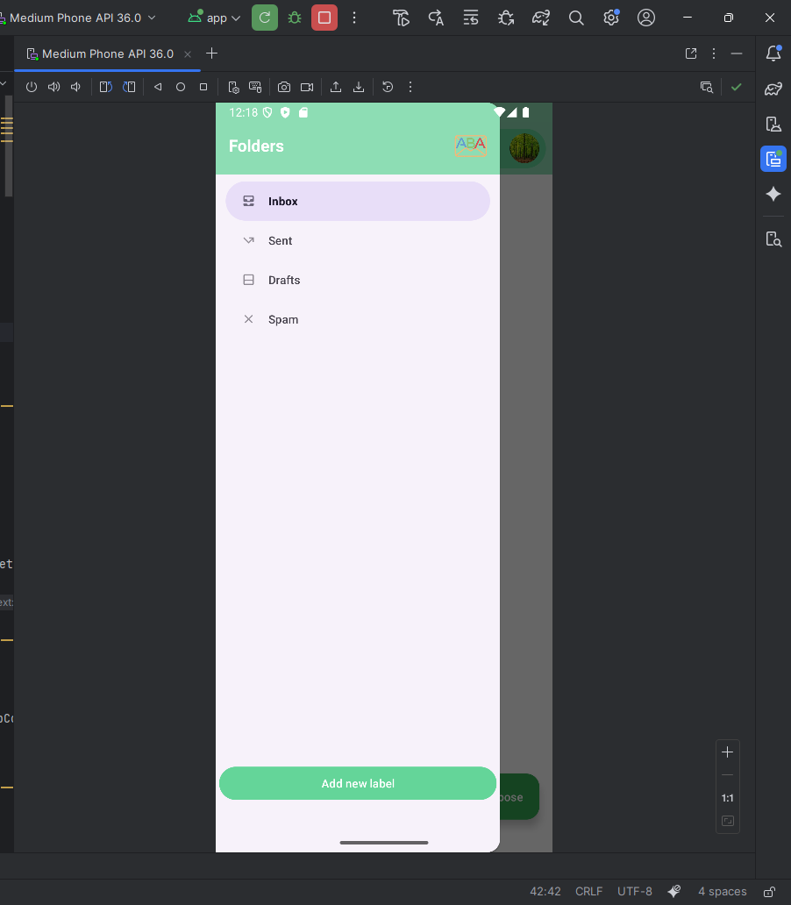
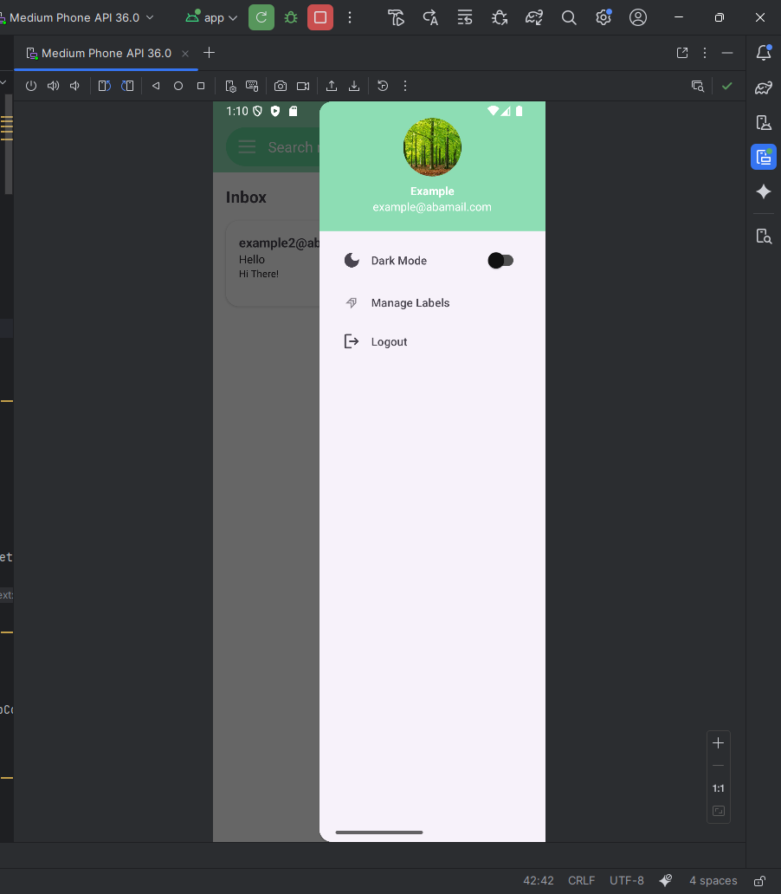
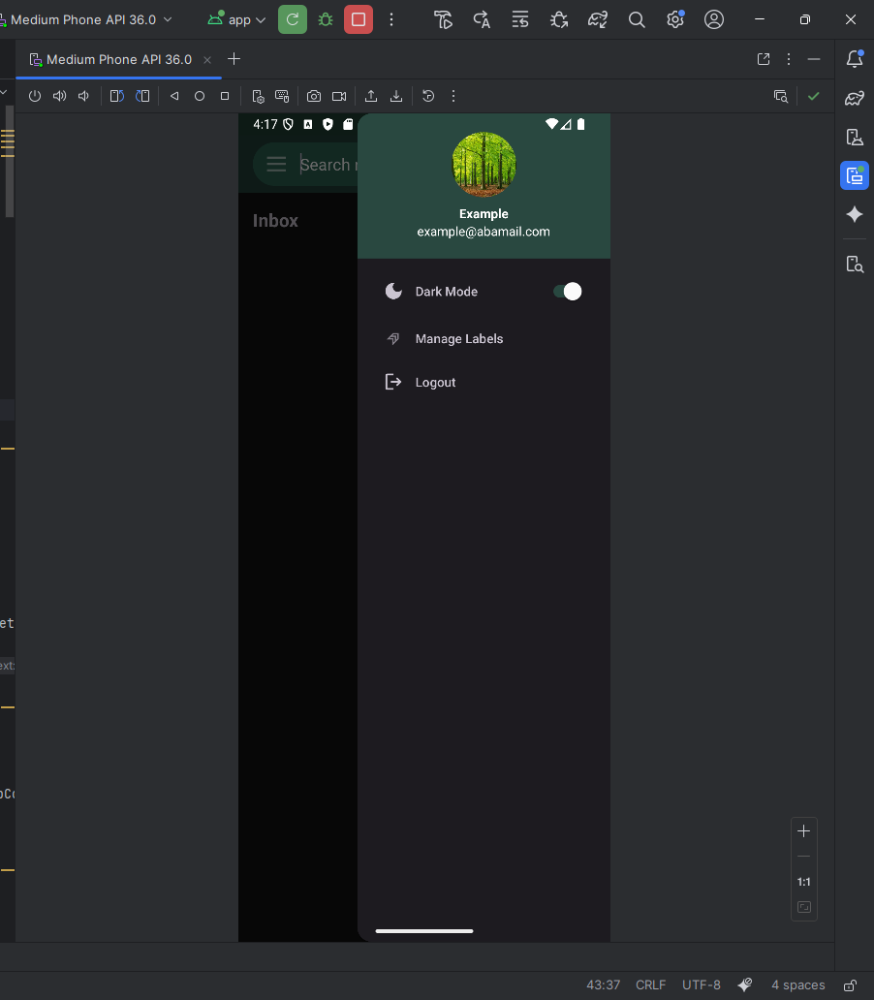

# ABA Android App

This page introduces the main page of the app and explains the menus and features it offers.

---

## Sidebar Menu

In the **top-left corner**, you will see the **three horizontal lines (hamburger icon)**.  
Clicking on them will open the **sidebar menu**.

  

The sidebar menu contains all your folders: **Inbox, Sent, Spam, and Drafts**, as well as any **custom label folders** you’ve created.

---

## Profile Drawer

If you click on your **profile picture**, another sidebar (profile drawer) will appear.  

Here you can:  
- Switch between **Light** and **Dark** mode (default is Light).  
    

- Log out of the user by selecting **"Logout"**.

---

## Related Features

For more details on how emails and labels work, see:  
- [Mail Operations](mail-operations.md)  
- [Label Operations](label-operations.md)  
