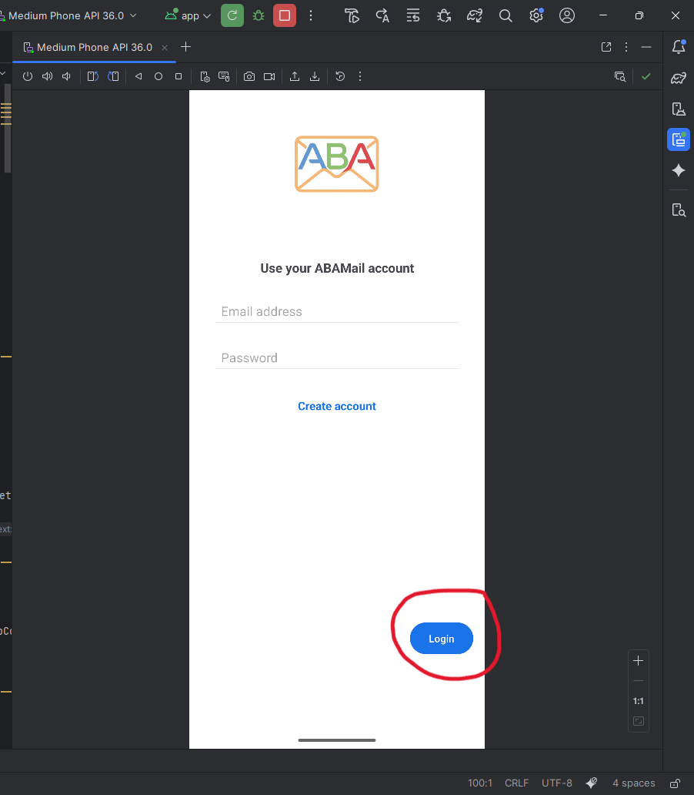
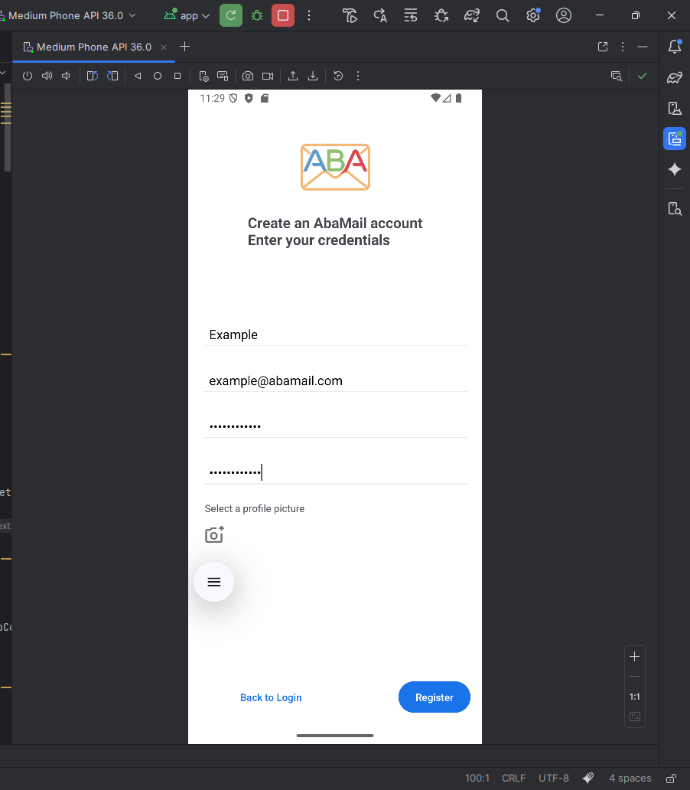
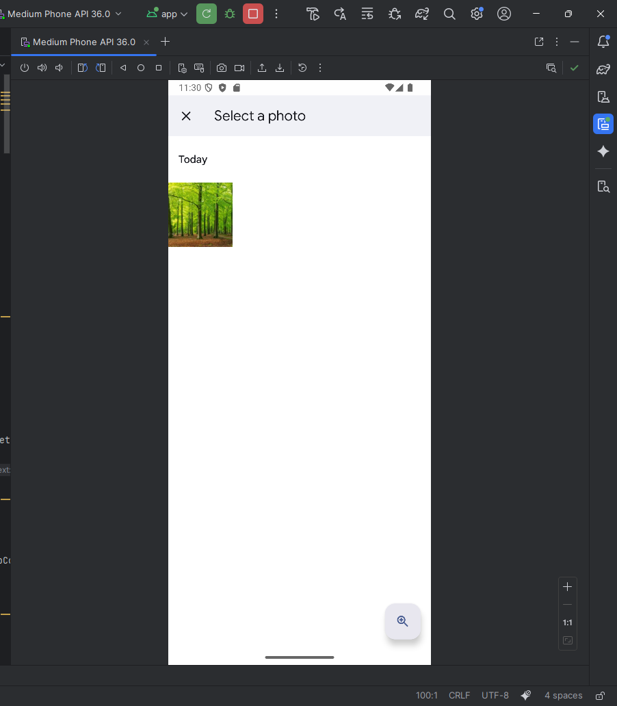
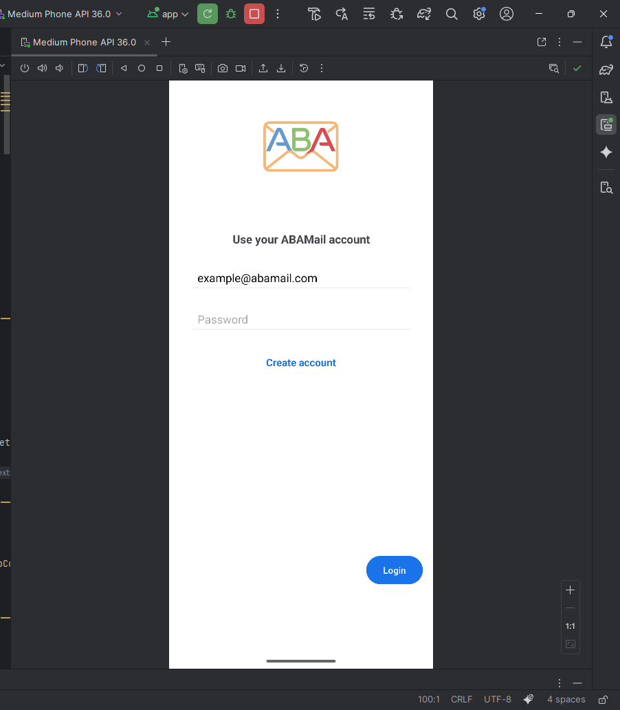
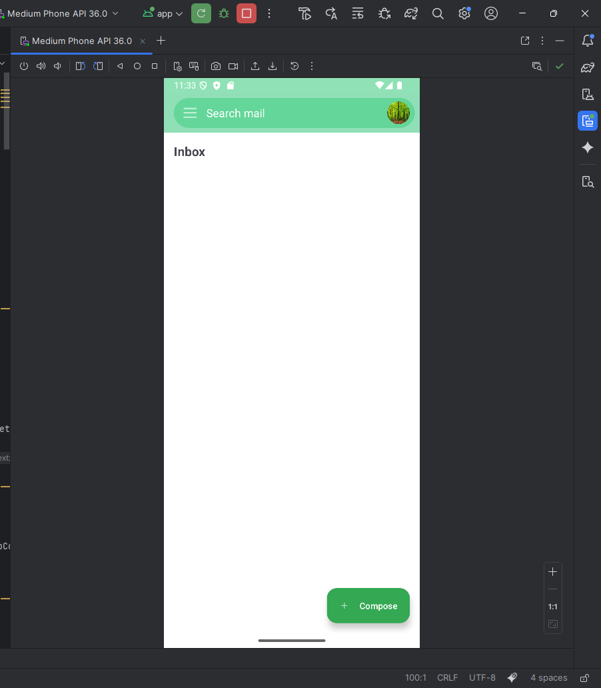

# Authentication

This page explains how user registration, login, and authentication work in the system.

---

## Overview

The backend provides the following authentication features:

1. **User Registration** – Create a new account with email and password.
2. **User Login** – Authenticate with email and password.
3. **JWT Tokens** – Backend returns a JSON Web Token (JWT) to maintain session and access protected routes.

---

## Registration

### Steps:

1. When first loading the app, the login page appears, if you do not have a user, click on 'Create Account'.

2. You will be redirected to the registration page, there you will need to enter the following:
   - User Name
   - Email
   - Password
   - Confirm Password
   - Optional: Upload an image from the phone to be used as your profile picture

3. Click on **Register**.
4. You will be redirected to the login page, with your mail address already prefilled in the mail address field.

5. Enter the password you signed in with, and click **Login**, you will be redirected to the home page of the app.

