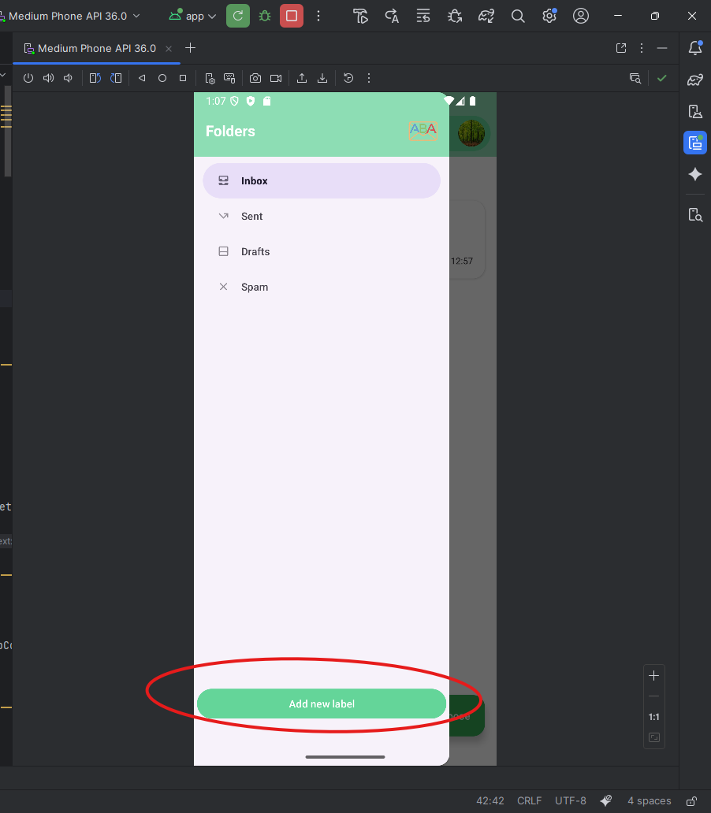
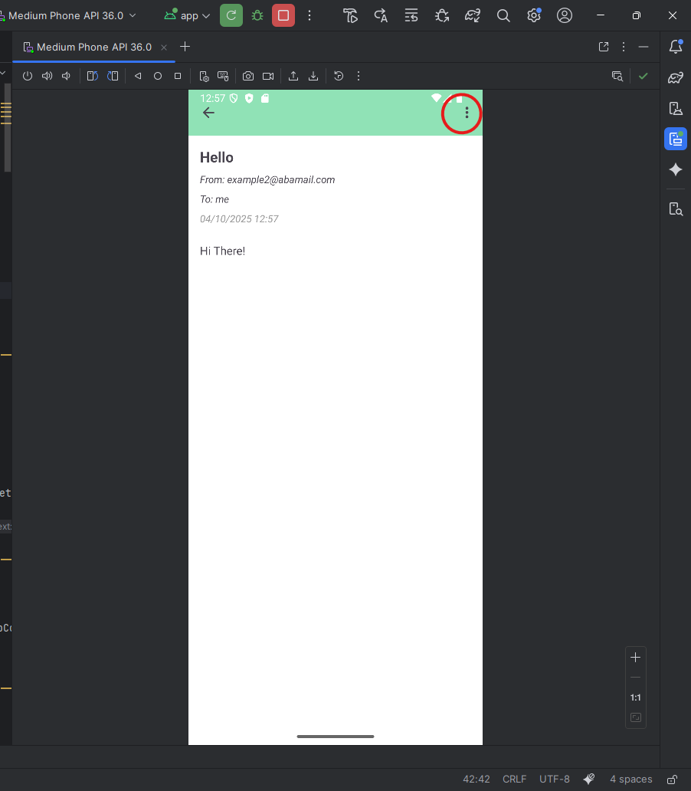
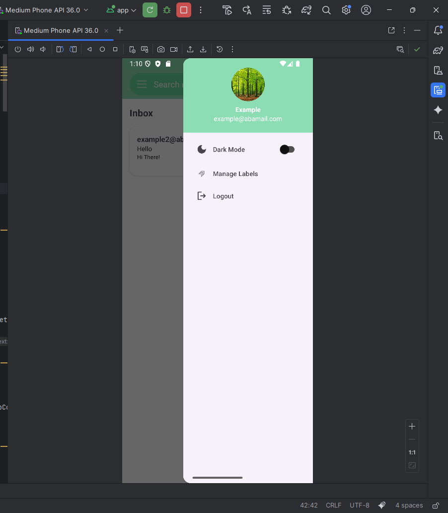

# Label Operations

This page explains how to use the **labeling system** in the app, including creating, assigning, and managing labels.

---

## Adding a New Label

1. In the sidebar menu, scroll to the bottom and click **"Add New Label"**.  

   

2. You will be redirected to a page where you can enter your new label name.  

   

3. After creating the label, it will appear in the sidebar menu. Clicking on the label will show all emails assigned to it.  

   

---

## Labeling an Email

1. Open any email.  
2. Click the **three-dot icon** at the top left.  
3. Select **"Label As"**.  

     
   

4. A list of your existing labels will appear. Check the ones you want to assign to this email.  

   

- If you uncheck a label that was already assigned, the email will no longer have that label.  
- After labeling an email, you can open the sidebar and click on the label to view all emails with that label.  

   

---

## Managing Labels

1. Click your **profile picture** to open the drawer menu.  
2. Select **"Manage Labels"**.  

   

3. You will see all your labels listed, each with a three-line menu icon on the right.  

   

4. From here, you can **edit** or **delete** labels.  

   
