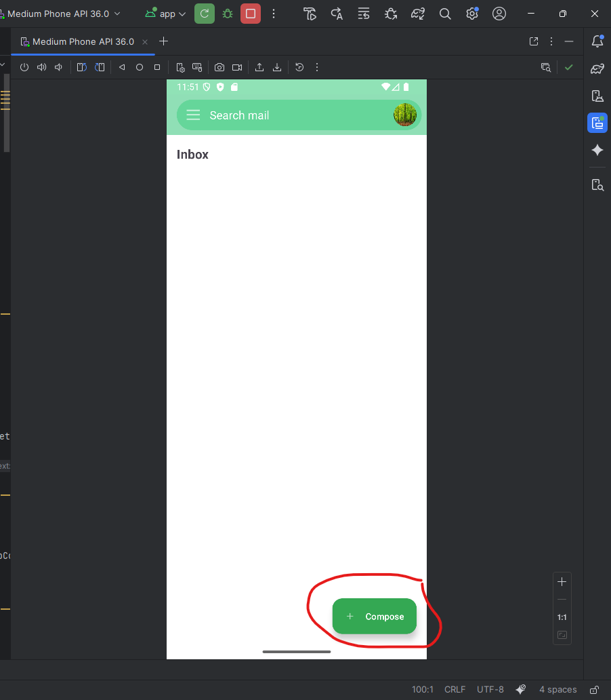
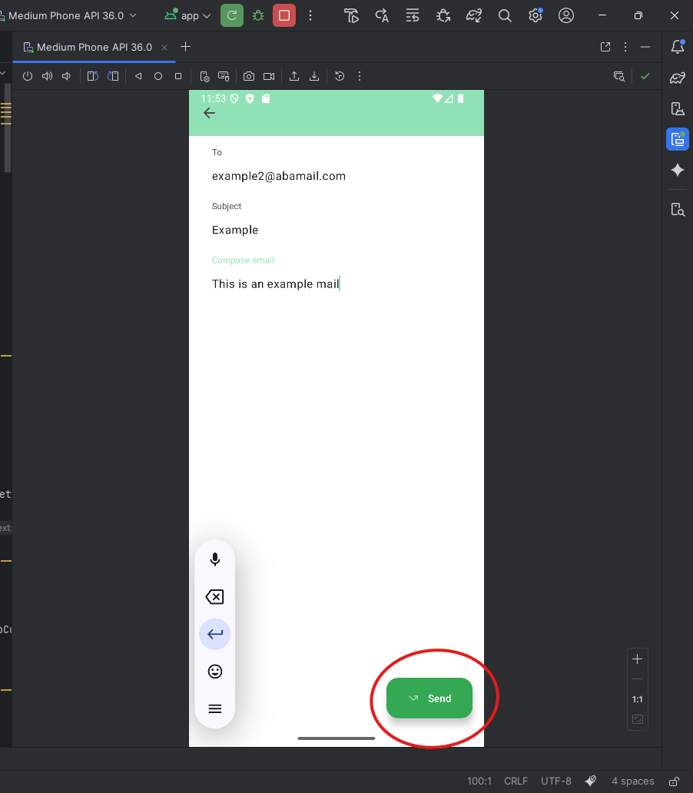
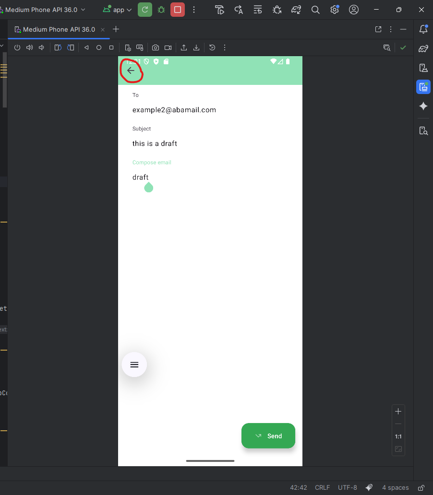
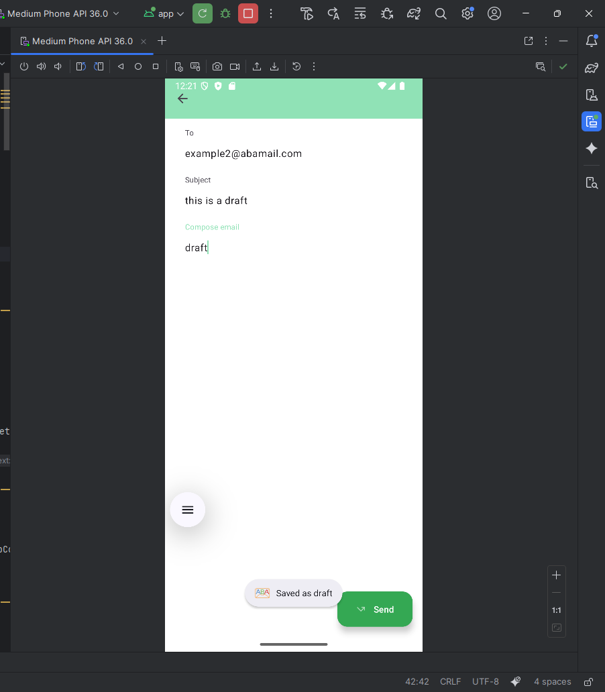
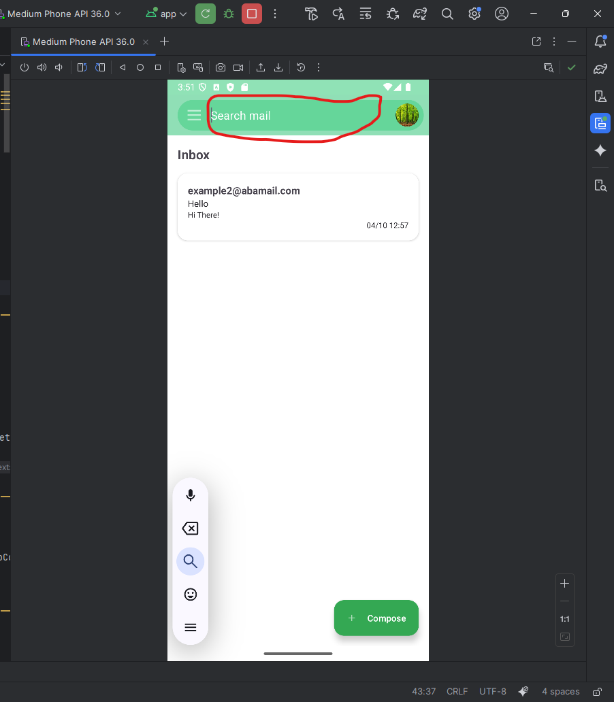
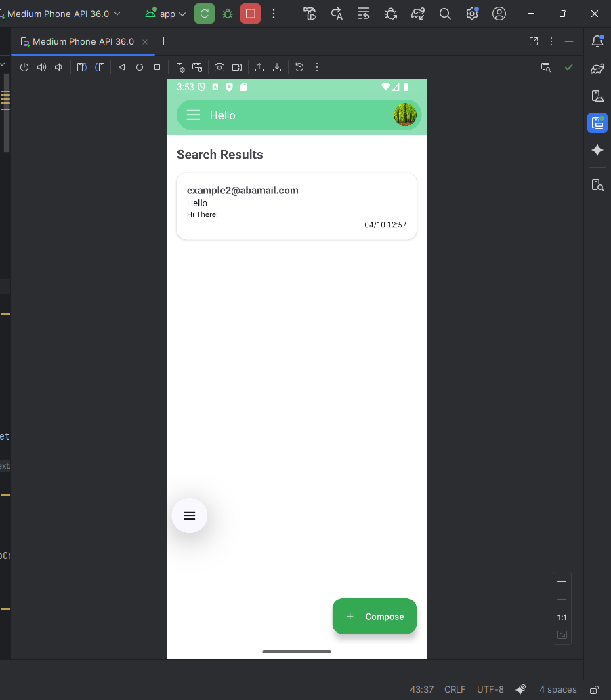
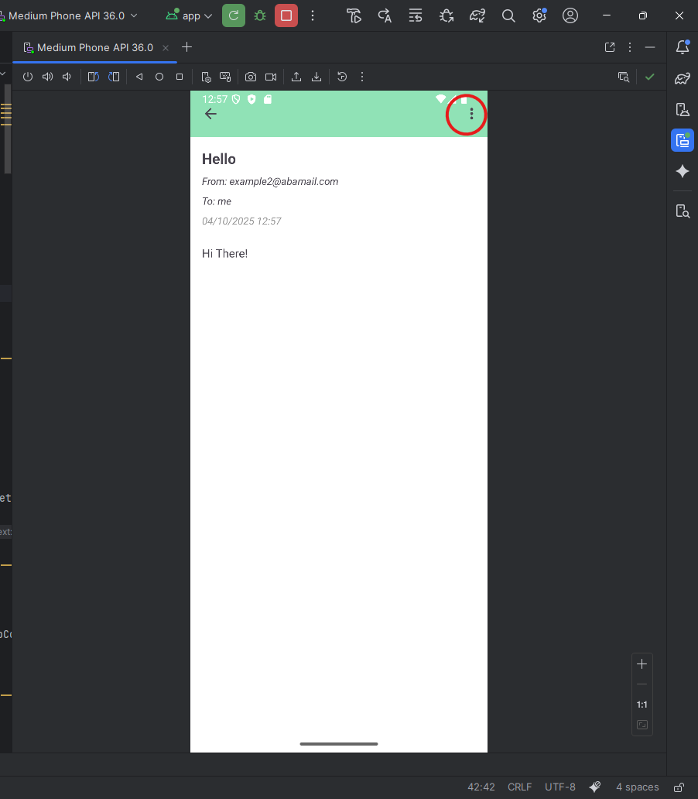
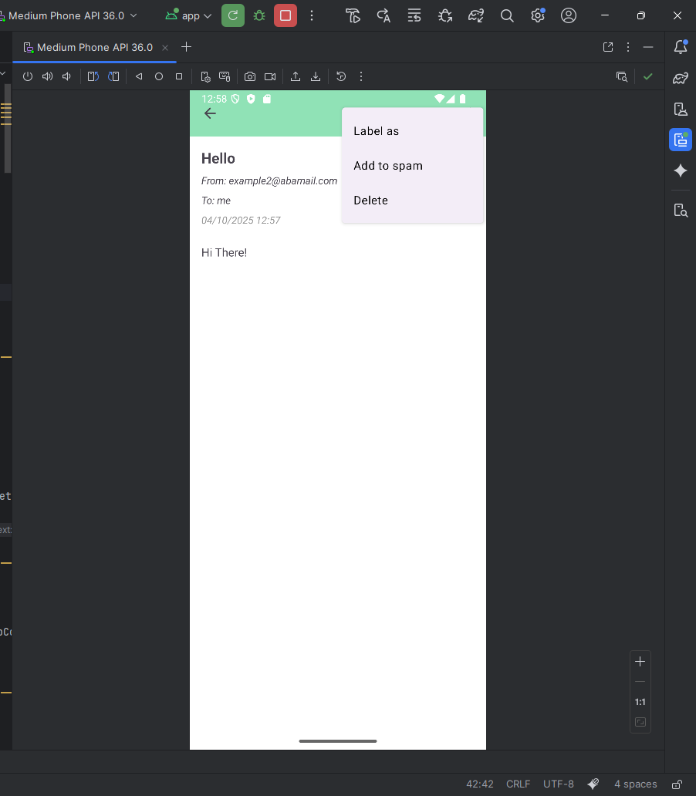

# Mail Operations

This page explains the various operations you can perform on emails in the app, including composing, drafting, editing, and managing emails.

---

## Sending an Email

1. Go to the **Compose** page:

2. Fill in the **recipient**, **subject**, and **body** of the email.
3. Click **Send** to send the email:

---

## Drafts

- If you open the **Compose Mail** view and close it **before sending**, the email is automatically saved in the **Drafts** folder.

  

---

## Edit a Draft

1. Open the **Drafts** folder.
2. Select the draft email you want to edit.
3. Make your changes.
4. You can either:
   - Click **Send** to send the email.
   - Go back without sending — changes will be saved automatically, and the email will remain in your Drafts folder.

---

## Searching mails
Our app supports searching for queries in all of a users mails (Inbox, Sent, Drafts, etc.).
In the main page of the app, at the center top, you can see a search bar. You can search for any query, and all the mails containing that query will appear.

## Operations on an Email

- Open any email and look at the **three-dot menu** at the top-right corner.  
- This menu provides the following options:

  

### Options:

1. **Label As** – Assign a label to the email. More information about labels can be found in [`label-operations.md`](label-operations.md).  
2. **Add to Spam** – Moves the email to the **Spam** folder. More information in [`spam.md`](spam.md).  
3. **Delete** – Permanently deletes the email.

---

