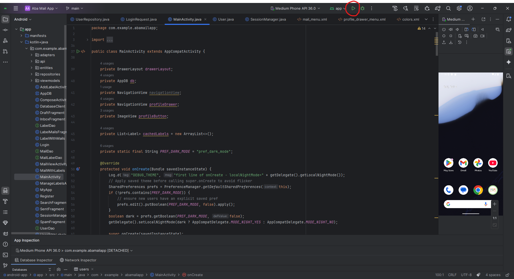

# Project Setup

## Requirements
Before running the project, make sure you have the following installed:

- **Docker & Docker Compose**  
  Used to run the backend and Bloom filter server containers.

- **Node.js**
  Needed if you want to run the backend without Docker.

- **C++ Build Tools**  
  Required to compile the Bloom filter server.

- **Android Studio**  
  - Required to run the Android client.
  - You can either:
    - use an Android emulator within Android Studio. (`Mediun phone API` is recommended)
    - Or use a physical Android device connected via USB with developer mode enabled.

---

## Build and Run with Docker Compose

- Open in terminal the main project folder (`Mail`).
- Build and run the backend with:
```bash
docker compose up --build
```  
This will run all required servers (backend, bloom-filter, mongoDB)


---

## Running the Android App

To run the Android client:

1. Open **Android Studio**.
2. Open the Android project folder (`android-app`).
3. Press the **green play button**, or Press **Shift + F10** to run the app.





4. Use an emulator or a physical Android device to see the app running.

> **Important:** Make sure the backend servers (Node.js + Bloom filter server) are running beforehand so the app can connect.
